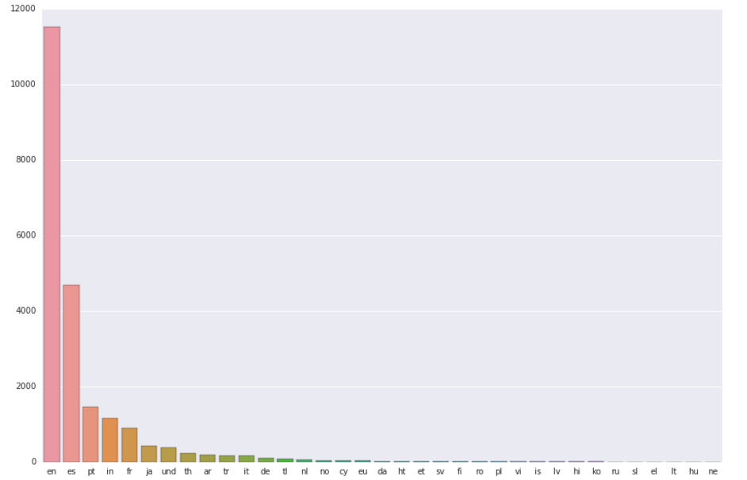
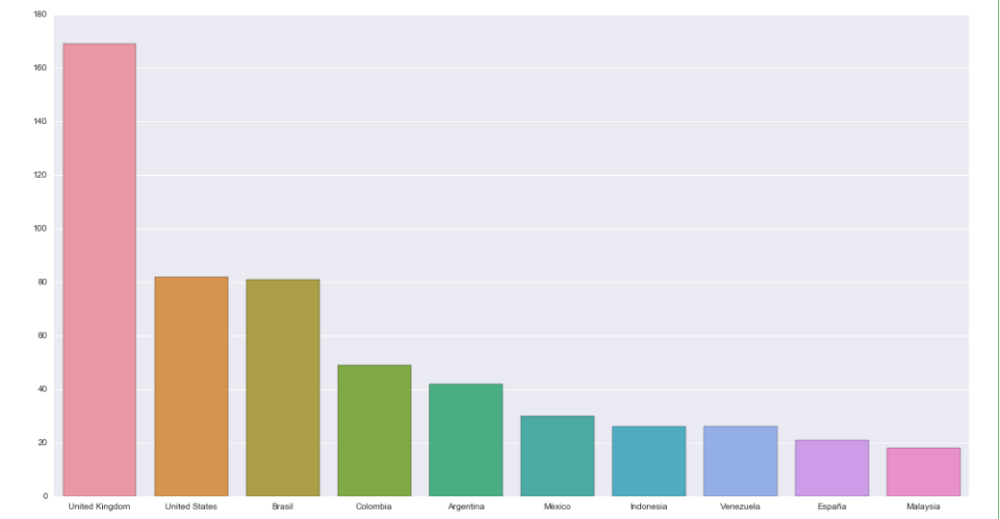
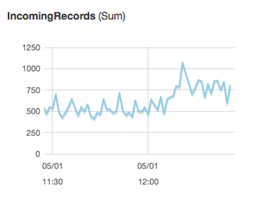

## Word Frequency vs Minute of play 

This is a visualization representing twitter reactions over minutes of play during two important matches in the English Premier League which ended up deciding the champion for this year (Leicester City). 

The visualization can be seen live [here](https://mickeykedia.github.io/epl-twitter-viz/).

The github repo for the streaming pipeline is [here](https://github.com/mickeykedia/EPL-Twitter) 

These matches were Manchester United vs Leicester City (May 1, 2016) and Chelsea vs Tottenham Hotspurs (May 2, 2016).

#### Timeline and short background
- May 1: Manchester United draw vs Leicester city (1-1) 
- May 2: Chelsea draw vs Tottenham (2-2) 

**Background**: Before the first match Leicester city had to win the match to win the league (first time in 132 years of club history, starting from 1-5000 odds at the beginning of the year). Manchester United has traditionally been the most dominating club of the EPL and to win the league at their homeground would have been epic for Leicester City. 
They ended up not winnning, but drawing (1 point), which put the focus on Tottenham's next match. 

Tottenham would have to now win all of its 3 matches to have a chance of winning the league, but they were playing at the homeground of defending champions Chelsea who are also traditionally bitter rivals. Before the game there was a lot of talk from Chelsea players who made it clear that they were supporting Leicester city and would do everything possible to deny Tottenham a win. 

Additionally Leicester city's manager Claudio Ranieri was earlier a manager at Chelsea and he had massive support from Chelsea supporters. 

As it turned out Tottenham scored two goals in the first half and Chelsea scored two goals in the second half in a game which was incredibly hard fought and full of ugly incidents on the pitch. As the match petered out to a draw, wild celebrations erupted all over the world as Leicester had just won the league. 

#### Thesis Document

I have made two linked charts which given a 'match' and a 'word' show 
- The frequency of occurence of that word over the time of the game (split by first half and second half)
- The distribution of frequencies of the occurence of the word over the entire game 
The first graphic shows potential stories related to a particular word at different moments of time in the game. In our context this sometimes represents things like
- A contentious foul
- A goal
- A player who was involved in an incident on the ground
- etc. 
The second graphic just gives us a sense of whether the word in question represents a flash event or a continous underlying theme. 

#### Process Document

The raw data is tweets pulled from the Twitter Streaming API with certain filter words during two critical matches in the English Premier League (Soccer). Either of these matches could have led to Leicester City actually winning the Premier League (this was supposed to be (and turned out to be) a historic event). I collected around 2.3 Million tweets during these two matches and after the match. 

For saving the tweets I set up a node js app, AWS Kinesis Firehose, S3 bucket pipeline. Then I analyzed these tweets by running spark on an AWS cluster and running map reduce operations on these tweets to extract the information I needed. 

The key idea for the visualization is the occurrence of words or phrases in tweets corresponding to events in the match. So choosing the right words and looking at the frequency of occurrence of these words in tweets over the course of the match can tell stories about what viewers and fans are talking about during the match. 

I chose a color gradient for frequency because it allows the minutes in the match which are important to pop out and be immediately visible with least effort. I chose to represent the minutes in the match with numbers because that's how the game is tracked in soccer, where traditionally major events in the game are referenced by the minute on the clock. 

The detailed source code and instructions on how to setup your own pipeline to collect tweets are at [my repo](https://github.com/mickeykedia/EPL-Twitter) here

#### EDA Plots 

##### What language do EPL supporters tweet in (from a sample of the data)?

##### What Country do EPL supporters tweet from (from a sample of the data)?

##### Number of tweets being collected per minute ?

### References

- Took inspiration from [Visualizing Shakespeare sonnetc](https://gramener.com/playground/shakespeare/network.html?sonnet=83)
- Calendar view [Mike bostocks bl.ocks - Calendar](https://bl.ocks.org/mbostock/4063318)

### TODO 

Improvements
- Right now we do exact searches for these words, it might be more representative to do some sort of fuzzy search (search for Goaaaaaal instead of Goal)

Possible things to do 
- Frequency for more than one word/phrases
- Do sentiment analysis of tweets and show frequency of sentiment by minute
- Network plot between tweets which contain more than one word/phrase alluding to relations between 
